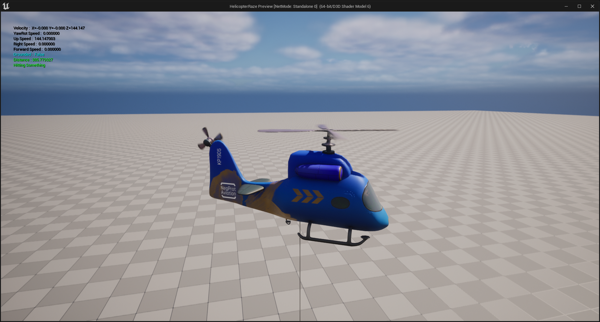
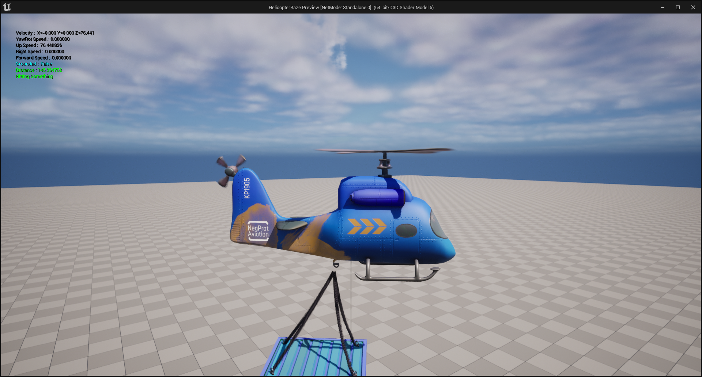

# HelicopterRaze

Helicopter Raze is an Arcade Game inspired by GTA VC's Helicopter Mission.
The Core objective is you've to control a Helicopter which picks up Detonators and places them in areas which are to be demolished within
a given time frame and also being same from environmental damages.

## Screenshots

>
> Helicopter Physics In Action

> Payload Physics In Action
> - Rope Physics through Bezier Curves

## Requirements

- Unreal Engine 5.1
- Blender 3.3 LTS
